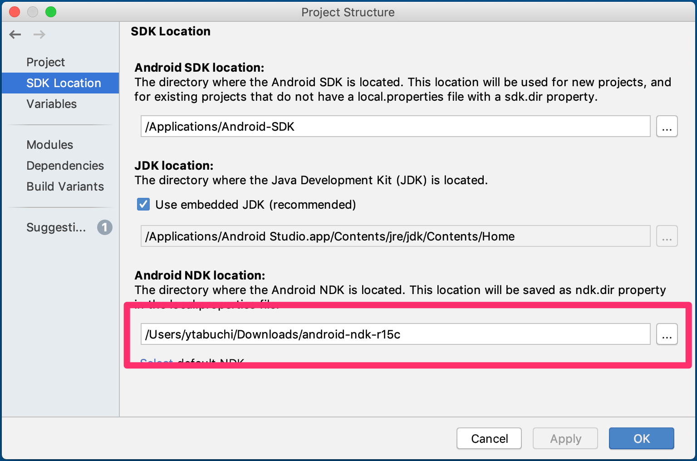
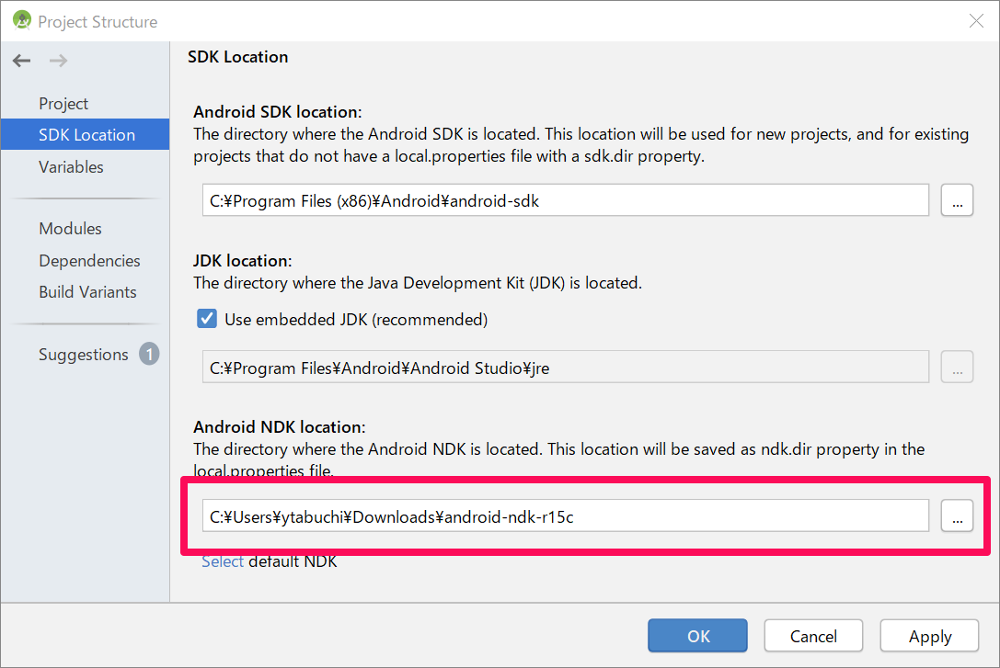
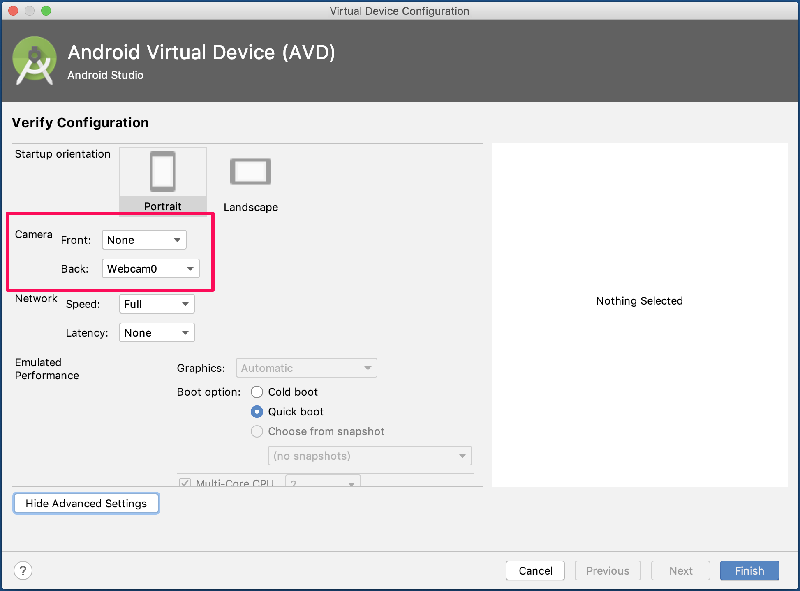
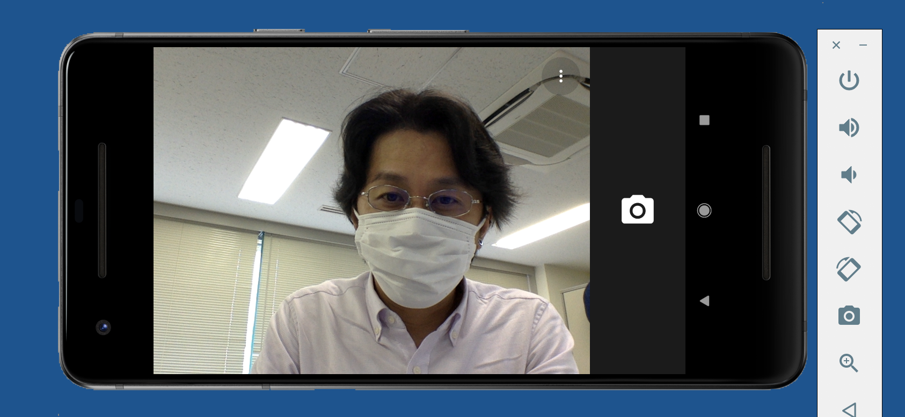

# KudanCV - Android Demo

[English Readme is here](./README_en.md)

このリポジトリには、KudanCV スタンドアロンライブラリを使用して、カメラで見たオブジェクトの画像ベースおよびマーカーレスのトラッキングを実行するサンプルアプリケーションの Android Studio プロジェクトが含まれています。

このコードは `android.hardware.camera2` パッケージを使用しているため、実行するには Android 5.0 以上のデバイスが必要です。従来のサポートが必要な場合は、非推奨の `Camera` クラスを使用しても同様の結果が得られます。


## 利用方法

- プロジェクトをクローンします。

- [エクセルソフトの Kudan ダウンロードページ](https://www.xlsoft.com/jp/products/kudan/download.html?utm_source=%E5%A4%96%E9%83%A8%E3%82%B5%E3%82%A4%E3%83%88&utm_medium=github_xlsoft&utm_campaign=KudanCV-Android-Demo) から最新の KudanCV ライブラリのダウンロードをお申し込みください。
  - 入手した `KudanCVSDK-Android.zip` を展開し、`KudanCV.h`、`arm64-v8a/libKudanCV.so`、`armeabi-v7a/libKudanCV.so`、`x86//libKudanCV.so` があることを確認します。

- `app` 以下に `libs/KudanCV/bin` ディレクトリを作成し、以下のディレクトリ構造になるように `.so` ライブラリファイルを ABI ディレクトリごと配置します。
  - `app/libs/KudanCV/bin/arm64-v8a/libKudanCV.so`
  - `app/libs/KudanCV/bin/armeabi-v7a/libKudanCV.so`
  - `app/libs/KudanCV/bin/x86/libKudanCV.so`

- `app` 以下に `libs/KudanCV/include` ディレクトリを作成し、`KudanCV.h` を配置します。

- [エクセルソフトの Kudan ダウンロードページ](https://www.xlsoft.com/jp/products/kudan/download.html?utm_source=%E5%A4%96%E9%83%A8%E3%82%B5%E3%82%A4%E3%83%88&utm_medium=github_xlsoft&utm_campaign=KudanCV-Android-Demo)から、開発用ライセンスキーを入手し、`AndroidManifest.xml` の `com.xlsoft.kudancv.API_KEY` の value に入力してください。

```xml
<meta-data
    android:name="com.xlsoft.kudancv.API_KEY"
    android:value="">
</meta-data>
```

- ビルドして実行します。


## 注意点

### NDK について

2019年4月時点の KudanCV ライブラリの仕様で、NDK 15c **以下** が必要になります。以下から「Android NDK, Revision 15c (July 2017)」をダウンロードし、任意のフォルダに展開してください。

[NDK Archives  \|  Android NDK  \|  Android Developers](https://developer.android.com/ndk/downloads/older_releases)

プロジェクトごとに NDK の場所を指定できるので、プロジェクトを開いたら、Android Studio　のメニューから「File＞Project Structure」を開き、「SDK Location＞Android NDK location」を展開したフォルダに指定します。





### Emulator について

x86 用のバイナリがあるので、Emulator のカメラでもテストできますが、Emulator 上のカメラアプリで PC のカメラ画像を取得できる状態に設定してください。





例えばこんな感じです。（写真は [@ytabuchi](https://twitter.com/ytabuchi) ですw）

## エクセルソフトについて

エクセルソフトは Kudan AR/CV SDK の販売代理店です。ライブラリに関するお問い合わせ、価格に関するお問い合わせはお気軽に [お問合せフォーム](https://www.xlsoft.com/jp/services/xlsoft_form.html?option2=Kudan&utm_source=%E5%A4%96%E9%83%A8%E3%82%B5%E3%82%A4%E3%83%88&utm_medium=github_xlsoft&utm_campaign=KudanCV-Android-Demo) よりお寄せ下さい。

